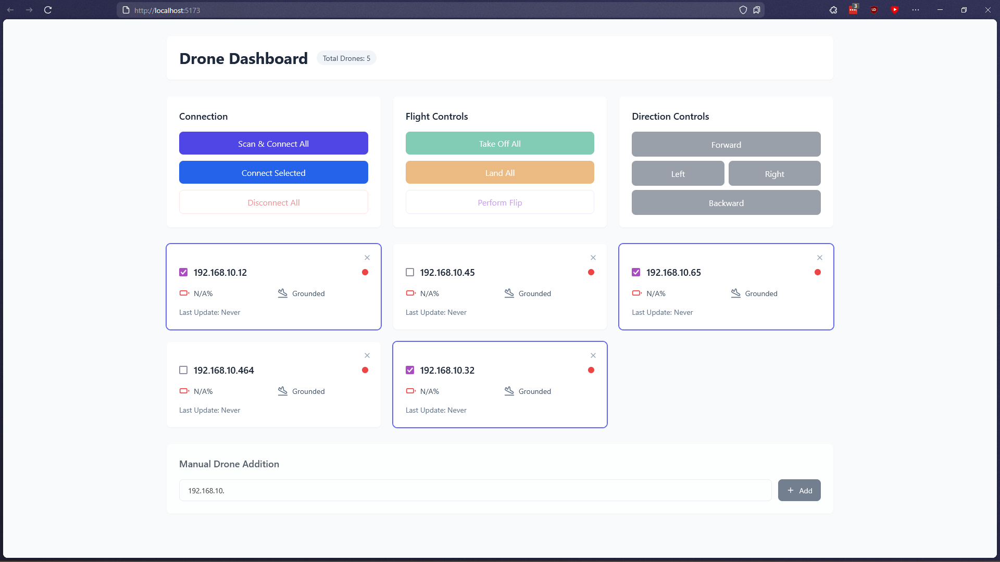

# 🚁 Tello Drone Swarm Control Dashboard

A web-based dashboard for controlling multiple DJI Tello drones simultaneously with an intuitive user interface.


## 🌟 Features

- 🎮 Real-time drone control and monitoring
- 🔋 Battery level tracking
- 🔍 Automatic network scanning for drones
- 🛫 Group commands (takeoff, land, flip)
- 📡 Connection management
- 🎯 Directional controls
- 💾 Persistent drone configuration storage

## 🏗️ Project Structure

The project consists of two main components:

### Backend (FastAPI)

- REST API for drone communication
- Drone swarm management
- Network scanning capabilities

### Frontend (React + TypeScript + Vite)

- Modern responsive dashboard
- Real-time status updates
- Tailwind CSS for styling

## 🚀 Getting Started

### Prerequisites

The drones are by default configured to emit their own hotspots. If you want to use them in a swarm you need to connect them to the same Wi-Fi network.

To do this, connect your laptop to the tello hotspot (TELLO-XXXX) and run the [switch_wifi.py](api+utils/switch_wifi.py) after setting the `ssid` and `password` variables of the wifi (ssid is the name of the wifi).

### Backend Setup

1. Create and activate a Python virtual environment and install dependencies:

```bash
pip install uv
cd api+utils
uv venv
source .venv/bin/activate  # On Windows: .venv\Scripts\activate
uv pip install -r requirements.txt
```

2. Start the FastAPI server with sudo to have network scanning capabilities :

```bash
sudo "$(which fastapi)" dev api.py # This will use fastapi from the venv and not the system one which can happen when using sudo
```

### Frontend Setup

```bash
cd dashboard
npm install
npm run dev
```

## 🔧 Configuration

### Network Setup

- The default IP range for Tello drones was `192.168.10.0/24` during our tests.
- The dashboard will automatically scan for drones in this range

## 🎮 Usage

1. Launch the dashboard in your browser
2. Click "Scan & Connect All" to discover available drones on the network
3. Select individual drones using the checkboxes
4. Use the control panel to:
   - Take off/land
   - Move in different directions
   - Perform flips
   - Monitor battery levels
   - Check connection status

# 🐛 Known Issues

The API does not allow to send commands to swarm without receiving confirmation from each drone (which is slow for some reason). The swarm will become unresponsive if one of the drone failed to respond.

I hope this can be fixed in the future by tweaking the API.
